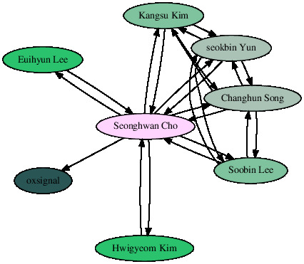

# PGP Activity

## Web of Trust Graph



## Ethical Conduct Agreement

```$ gpg -d Agreement.md.gpg```

```
# Ethical Conduct Agreement for IS-521

I hereby consent to the terms in this Agreement.

1. I agree to not use the hacking knowledge and skills gained in the
course of study to attack other systems or networks, and I agree to
apply such knowledge solely for lawful purposes.

2. I understand that the release of confidential information may be
detrimental to national security and to the interests of KAIST, and I
agree to not divulge any confidential information obtained during my
course of study.

##### 2019-03-18
##### Signer: Seonghwan Cho
gpg: Signature made 2019년 03월 18일 월 오전 11:58:43
gpg:                using RSA key B92BF45EC8295F4B43DBC1145F6AEAE9A84DD8E4
gpg: Good signature from "Seonghwan Cho <cshwan@kaist.ac.kr>" [ultimate]
gpg:                 aka "Seonghwan Cho <csh4129@gmail.com>" [ultimate]
```
